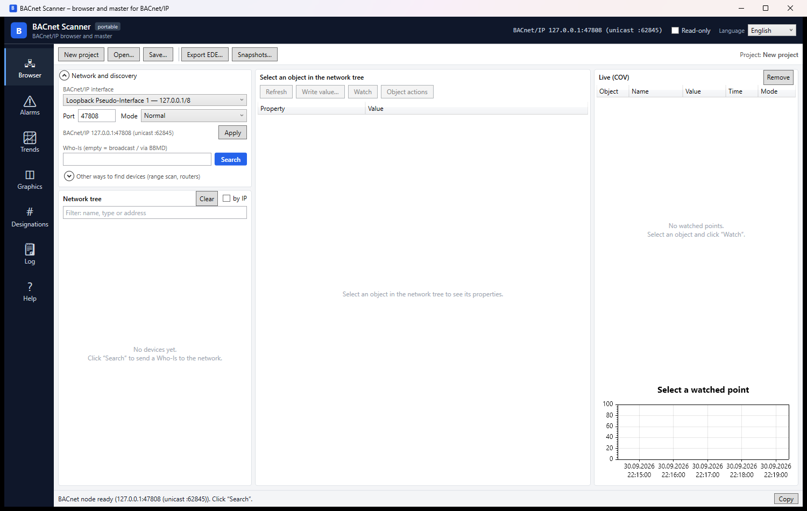

# BACnet Scanner

A BACnet/IP browser and master for Windows: find the devices on a network, read what is in them, write to
them, watch values live, handle alarms, record trends.

A native Windows program (.NET 8). Nothing to install besides the program itself: the runtime is included.

> **This is a beta.** It is complete enough to use on real equipment, but it has not been through a season of
> daily work. Expect bugs, and **please report them** — see [Reporting a problem](#reporting-a-problem).

*The browser before a search: the BACnet/IP interface and mode, the network tree, and the live (COV) panel
that watches points once you pick them.*

## Download

The latest [release](../../releases) has, for Windows x64:

| File | For |
|---|---|
| `BacnetScanner-<version>-x64.msi` | install for all users: Start menu shortcut, firewall rule for UDP 47808 |
| `BacnetScanner-<version>-x64-portable.zip` | unpack and run; all data stays in a `Data` folder beside the program |

The portable build writes nothing to the user profile as long as `portable.txt` sits next to the executable,
so it runs from a memory stick. The packages are not digitally signed, so SmartScreen warns about an unknown
publisher.

Silent install: `msiexec /i BacnetScanner-<version>-x64.msi /qn`.

On first start Windows asks about firewall access — allow it for the network the devices are on (UDP 47808).

## What it does

**Network and discovery**
- The BACnet/IP interface and port, and the network layer mode: **Normal**, **Foreign Device** (registration
  with a remote BBMD, renewed every TTL/2) or **BBMD** (the program accepts registrations itself — IP filter,
  broadcast distribution table, a view of the registered devices).
- **Who-Is** broadcast or unicast, an **IP range scan** for devices behind a router or a VPN (at most 4096
  addresses), and **router discovery** (Who-Is-Router-To-Network → DNET numbers).
- A saved interface that no longer exists — a different network, a VPN switched off — does not block the
  program: it picks an interface on the same subnet, says what it used, and lets you correct it.

**Browsing and writing**
- Devices → objects grouped by type, filtered by name, type or address. The object list is read even from
  devices without segmentation, element by element.
- Properties through ReadPropertyMultiple where the device supports it, otherwise one at a time, shown in
  readable form: units, binary states, status flags, priority array, object types.
- **Writing a value** with the data type (auto, REAL, UNSIGNED, ENUM, BOOLEAN, text, NULL), priority 1–16 and
  **releasing a priority**.
- **Live (COV)** — several points at once, with subscription renewal, falling back to polling where the device
  does not support COV; a table and a chart of the selected point.

**Schedules and calendars** — a weekly schedule editor (7 days × time/value entries, copying a day, NULL) and
an exception-schedule editor (period, priority, time=value pairs; dates with wildcards, ranges, weekdays or a
calendar reference). Writes are confirmed and read back. Where a device has no exception-schedule, that tab
disables itself with a note and the weekly schedule still saves.

**Alarms** — event notifications live, written to a file, the ones needing acknowledgement highlighted and
acknowledgeable; active alarms in devices (GetEventInformation / GetAlarmSummary); and registering this
program in a Notification Class recipient list — and removing it again — without disturbing the other
recipients.

**Trends** — cyclic recording of present-values to CSV, resumed automatically after a restart, and reading
trend-log buffers through ReadRange.

**Also** — a simple graphics editor bound to live points, ISO 81346 / AKS / AMEV designation analysis of
object names, projects (`.bacproj`), EDE export, state snapshots with a comparison of two of them, and a
diagnostic log.

## Writing to a device

These properties hold everywhere in the program and cannot be switched off:

- every write is confirmed first, in a dialog naming what is changing and in which device;
- after writing, the value is read back;
- every write is recorded in `audit.log` with time, user, device, address and value;
- **read-only mode** refuses every write at the transport, so nothing can leave the program by any route;
- digital inputs are read-only.

The program cannot stop the device's own program from overwriting a value afterwards, and the confirmation
dialog says so.

## Using it

Press **F1** anywhere for the built-in manual. The interface is **Polish, English or German**, switched in the
title bar and applied at once. Start with the blue **Search** button (a broadcast Who-Is); range scan and
router discovery are folded away under "Other ways of searching", because they are only needed where a
broadcast does not reach.

## Known limits

- The graphics module is kept but no longer developed, and has no background image.
- Creating a File object in a device (CreateObject) can be attempted but most controllers refuse it.
- No tuning and no Saia: for those, see **PID Autotuner**.

## Reporting a problem

Send what you did, what happened, what you expected — and the log file, which says more than anything else.
The status bar message has a **Copy** button, and the Log module has **Open the log folder**; the current
day's file from there is the one to attach.

[Open an issue](../../issues) or write to **kontakt@ihvac.pl**.

## Licence

MIT. The source lives in a private repository; the released programs bundle only MIT-licensed libraries.

There is no warranty of any kind. The software writes to building automation devices; the installation you
connect it to stays your responsibility.
